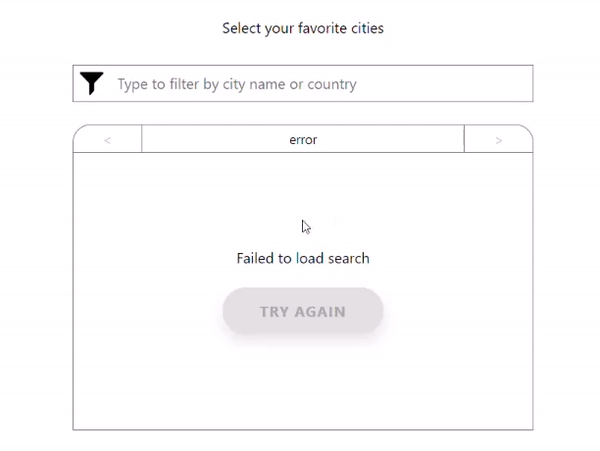

# ASAPP Front End Challenge
---

## Running the API
To run the API you'll need a version of Node and NPM with `npx` (Node 8+). Then
run `api-server` (for a \*nix like environment) or `api-server.bat` (for
Windows).

Once that the server starts, it will be listening at http://localhost:3030

The API reference is also available at http://localhost:3030/help

## Installing & Running the Frontend
From the frontend directory run `npm install` to install and then `npm start` to start the server

---
## UX Changes

### Pagination

API GET '/cities' returns all results with no limit. Scrolling through a list up to 23,018 items long can be tedious and it's easy to get lost in. 

To address this I've implemented pagination ontop of the container with buttons to go forward or back by intervals of 10. You can press the buttons multiple times quickly to move forward by x # of intervals up to either the first or last pages. 

### Number of Results

User has no idea how many results there are.

To go along with the pagination I've displayed the total results as well as displaying the indicies of the results you are looking at helping the user keep track of their position inside the larger result of list.

### Move User's Favorites

List of favorites can become hard to read with many favorites.

In the original mockup the list of favorites replaces the header. While this works for a small number of selections, as the list grows the size of the view will grow and it can become unruly. I've moved all of the user's favorite's to it's own container below the search results. This is list is set up with pagination the same way as the results. This makes managing your favorites more manageable!

### Click Lookup

Removing favorites is time consuming. You have to manually type in the city or it's subcountry or country.

To go along with the favorites list I've implemented a feature to quickly search for a city on your favorites. Simply click on it from the favorites list and it will update the serach bar with the city name.

### Clear button

A small quality of life improvement that allows you to quickly reset the searchbar. Its hidden until a non-white space character is input into the searchbar.

### Display Loading

Requests with this API can take up to 5 seconds to resolve. I've added various loading screens to signal to the user that the application is loading.

### Display Failures

Requests with this API fail ~ 10% of the time. I've added components to display failures to the user. I've also included buttons or click functionality to re-try the individual failed request.
